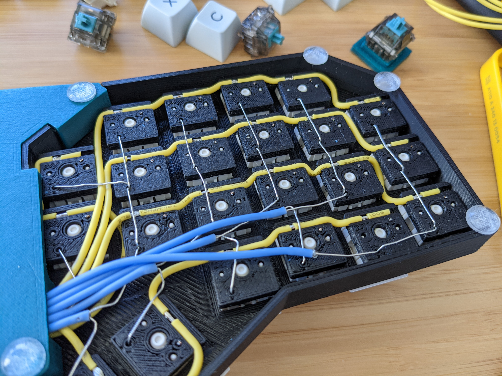

# 3D-Printable Hotswap Keyboard PCB Generator


This is an OpenSCAD script that can be used to generate 3D-printable hotswap "PCBs", plates, and cases for prototyping new keyboard layouts. I originally wrote this to help me prototype a split ergo layout without needing to solder/desolder all the switches every time. If you're only going to be building the keyboard once, this is probably a lot more work than just handwiring, but it might be useful if you're iterating on a design and want to reuse your switches easily. Currently supports MX and Kailh Choc v1 switches. If someone wants to send me low-profile Cherry switches, v2 Chocs, or Alps I can add those as well.

### Features
- Support for MX-style and Kailh Choc switches
- Automatically generate plates from the same layout data
- Generate cases with tenting options
- Integrate microcontrollers and TRRS sockets for a fully-functional keyboard
- Support for stabilizers
- Support for non-standard grid spacings

### Usage
The OpenSCAD script reads the layout data from the `layout.scad` header file, which you can either write by hand or generate from a KLE json file using the provided script (requires node.js 14+):
```
cd script/
npm install
npm start -- <layout json file>
```
Once the basic layout is set there are more values you can tweak in `layout.scad` to change the footprint of the PCB, add components like MCU/TRRS sockets, and add stabilizers/standoffs. Other parameters such as wire/pin diameters and pcb/plate thicknesses (and many many more) are contained in `parameters.scad`. All these values are described in full in the [`scad/` README](scad/README.md). [`default_layout.scad`](scad/default_layout.scad) contains an example layout that uses most of the available customizations, so you can see what's possible. The [`example_layouts/`](example_layouts) directory contains a couple of other examples as well, with varying degrees of complexity.

### Assembly
The [full build guide](guide/build_guide.md) goes into much more details and has pictures of the process, but here's how assembly works at a high level:

1. Use `pcb.scad` to generate an STL for 3D printing. Any print settings should work, though you may want to tweak the hole sizes depending on your printer's tolerances and desired fit tightness. A utility knife, and some drill bits may help with post-processing.

2. (Optional) If desired, you can use `case.scad`, `plate.scad`, and `backplate.scad` to generate a case.

3. Measure out and cut wires for the rows and columns, and press them into the corresponding channels in the PCB.

4. Bend your diodes and install them in the sockets. I designed this for glass 1N4148 diodes, though you can tweak the size of the diode cutout if the ones you have don't fit for some reason.

5. (Optional) Use a utility/craft knife to cut slits in the row wires where the switch pins go. The switch pins are usually sharp enough to pierce the insulation, but this makes switch installation more reliable.

6. At this point you have a completed PCB, and you can mount it to your plate and add switches and other components (as you would with any other PCB).

### Design Details
The design uses 22AWG stranded wire for the matrix rows and columns (wire gauge is configurable via `wire_diameter`), with the top switch pin plugging directly into the row wire and the diode cathode sticking through the column wire. The bottom switch pin makes contact with the diode anode, though that connection can be a bit finicky. I've solved this for now by putting a slight angle on the channel that holds the anode leg and switch pin, but it does slightly bend the switch pin in the process. The bend is pretty minor and can be easily bent back, but the angle is configurable via `diode_pin_angle` if you prefer not to have one. You can also use a bit of aluminum foil to solidify the contact point, but I found that to be too tedious in practice. There is an experimental setting for MX sockets that creates more reliable connections at the expense of more complexity when bending diodes. Electrical integrity is pretty good overall once the switches are properly seated. Hole sizes and such are tuned to my printer, which isn't the most dimensionally accurate, so you may get a better fit by tweaking the hole sizes slightly. I also recommend generating the final STL with a larger `$fn` value (the edge count for circles), though it does take a while to compile.

The basic layout format matches the commonly-used Keyboard Layout Editor (KLE) format, and the provided node.js script can convert a KLE json into an SCAD file that is included in the main script as a header. I originally wanted to use the OpenSCAD customizer to do this, but it turns out that doesn't support nested vectors at the moment. There are also a couple of additional parameters on each key in the `base_key_layout` array pertaining to the geometry of the PCB that you might want to change. One affects how much the PCB extends past each socket, which allows you to trim off excess on the edges and connect parts that are not directly adjacent (such as thumb clusters). Another allows you to rotate the wire channels for the column wires, which is also useful for wiring parts that don't follow a grid, like thumb clusters. This format is also used to position and configure all the other types of components you can add to your board. The [`scad/` README](scad/README.md) contains a full description of all of these options, and [`default_layout.scad`](scad/default_layout.scad) contains a comprehensive example that uses most of them.

### Additional Context
My original design was inspired by [stingray127's handwirehotswap project](https://github.com/stingray127/handwirehotswap), with the key difference being that I wanted to use stranded wire for the row contacts. That design worked pretty well, but I was using diode legs to connect the sockets vertically, and those connections turned out to be pretty flaky. In addition, there was nothing holding the sockets in place besides friction with the switch legs, and when seating switches you had to be pushing up on the socket from the back. I solved these problems by just using another set of wires for the columns and combining all the sockets into a solid plate.

After that I got some requests to add a plate generation feature, and I went overboard from there.

### Gallery
Completed keyboard


Bare split PCB


Keyboard with tenting


Completed keyboard (v1, case designed in FreeCAD)


Back of the PCB (v1, disconnected thumb cluster)


OpenSCAD output (v1, no MCU or TRRS)


Original design with separate sockets and no wire management

