# Design Guide

### Introduction
This guide covers how to transform a KLE layout into a `layout.scad` file that you can use to generate STLs for a PCB, plate, and/or case.

### Keyboard Layout Editor
While it's possible to manually enter all of your key positions into `base_switch_layout`, I highly recommend using [keyboard-layout-editor.com](http://www.keyboard-layout-editor.com/) to create your initial layout. It provides a graphical interface and intuitive controls that allow you to easily position, resize, rotate, and label keys to form a keyboard layout. Most importantly for our purposes, these layouts can be exported in a JSON format that can be used for other applications that need to represent a keyboard layout, like this tool. Despite some spotty maintenance and a somewhat restrictive license, the JSON format has become something of an industry standard for representing keyboard layouts. Most common keyboards already have KLE layouts available, which you can find with a little bit of searching. Any layout JSON can be downloaded by clicking the green "Download" button at the top right, and selecting "Download JSON" from the dropdown.

For this tutorial, we will be using the default layout, which I've tentatively named the Siamese Kitten. A screenshot of its KLE representation (with matrix locations on the keys) is shown below. You can view the original layout [here](http://www.keyboard-layout-editor.com/#/gists/9c44a869ba4c04c40b0c1d6b4f704bc2).
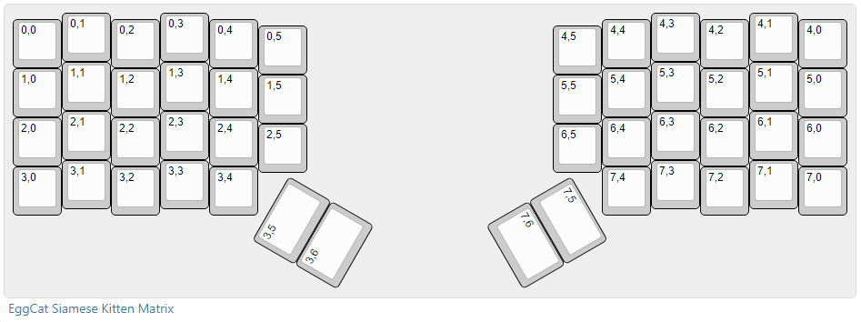

When creating your own layout for use with this tool, the labels on each key are ignored, so you can use any layout that has the proper key positions and shapes. This tool can also only handle keys that are exactly 1 unit tall, because of how it calculates the locations of keycap stems. If you want a vertical 2-unit key, you can get around that by creating a horizontal 2-unit key and rotating it 90 degrees. For keys like ISO Enter, replace them with a key that has the same stem layout. If you're working with a split layout, you should export the two sides separately. If the two sides are symmetrical, you only need to export the left side, since the whole layout can be flipped in SCAD.

### Conversion Script
The bridge between KLE and OpenSCAD is the conversion script located in the [`script/`](../script/) directory. This will take a KLE JSON file and plug the key location data into a template for `layout.scad`, which is placed in the `scad/` directory. Here's the basic usage:
```
npm start -- <layout json file> <optional output filename>
```
See the `script/` README for more details on installation and usage.

### `layout.scad` & `parameters.scad`
After running the conversion script, you'll have a `layout.scad` with `base_switch_layout` populated, but everything else empty, which will result in a PCB that looks something like this:
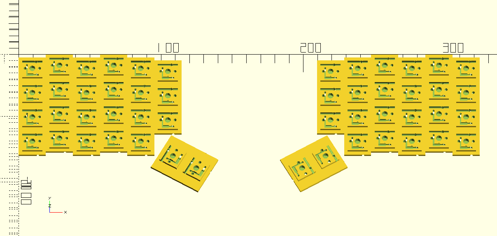

As you can see, I didn't take my own advice, and exported both hands in the same file. This can be fixed by deleting all the elements in `base_switch_layout` where `x_location > 10`. If your layout is column-staggered, you may also notice that the keys in `base_switch_layout` are jumbled up, since KLE exports key locations in row-major order. You may want to rearrange the keys by columns so it's easier to read.

In order to customize the keys further, you'll want to get familiar with the data format that the SCAD code uses to represent layouts. Each layout variable is a vector, where each element is in this format:
```
[
    [                                       // Location Data
        [x_location, y_location],
        key_size,
        [rotation, rotation_x, rotation_y],
    ],
    [                                       // Borders
        top_border,
        bottom_border,
        left_border,
        right_border
    ],
    extra_data                              // Extra data (depending on component type)
]
```
There are 3 components to this vector: location data, borders, and extra data. Let's dive a little deeper into each of them.

#### Location Data
This is the data that we get from the KLE JSON. For each key, `[x_location, y_location]` defines the position of the top left corner of the key, represented in key units. Note that the y-axis points downwards, with the origin at the top left corner. `key_size` defines the horizontal width of the key, also in key units. `[rotation, rotation_x, rotation_y]` defines a point around which to rotate the key, and the angle at which to rotate it counterclockwise. Note that the rotation direction is the opposite of what KLE uses, but the conversion script should handle this for you.

Both key size and the rotation data are optional, though if you include rotation data you must also include the key size.

#### Switch Options
Next we'll take a quick detour to discuss switch options. These are located in `parameters.scad`, and the main choice you have to make is between MX and Kailh Choc switches. This affects the socket generated, since the pin arrangement is different, and it also determines the plate thickness and PCB-plate spacing (used for the standoffs).

#### Borders
The border vector defines the width of the recessed border that runs around each key socket, as a multiple of `border_width`. `border_width` is defined as the distance between the edge of the socket and the edge of a 1-unit footprint, and was defined this way so that a border of `[0,0,0,0]` generates a socket with no border, while `[1,1,1,1]` generates a socket with a 1-unit footprint. If you wish to define a border in millimeters, simply multiply by `mm`, which is a helper value defined under the hood as `1/border_width`. The conversion script automatically generates borders that match the footprint of the key, which for a normal keyboard layout will generate a perfectly connected PCB. The border vector is optional, with a default value of `[1,1,1,1]`, though it must be defined if `extra_data` is used.

In the PCB above, you can see that all the adjacent sockets are connected, but since the thumb clusters don't sit on the grid they're kind of floating out there. If you're just looking for something quick, this can still be wired up, but it's nice to have the PCB be one piece. To do this, we can extend the top border of the top thumb cluster key by 25mm, and the bottom of the 6th column by 15mm. You can also reduce the footprint of the PCB by zeroing borders along the outside edge, which can be helpful when fitting the PCB into a case. Here's what the PCB looks like after the border changes:
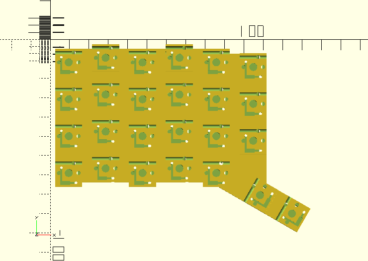

If you're creating a row-staggered layout, you'll want to set `layout_type = "row"`, which will cause the borders to be shifted to the top side of the PCB, making column wire routing cleaner. This also means that your PCB should be printed upside down to reduce unnecessary overhangs and bridges.

#### Extra Data
This is a catch-all field for extra data that is passed into the component module, and what it is depends on the component type. For `base_switch_layout`, this is a boolean value that defines whether or not the wire channel on the bottom of the PCB is rotated 90 degrees, which can be useful for wire routing on thumb cluster keys (or any other rotated keys). On the default layout I like to rotate the columns on both the thumb keys. We'll cover other uses of `extra_data` as they come up.

#### Other PCB Components (MCU, TRRS, stabilizers)
In addition to key positions, you have the option to add an MCU (like a Pro Micro) and/or TRRS socket to your keyboard, via the `base_mcu_layout` and `base_trrs_layout` variables. These use the same layout format described above, and don't use `extra_data`.

The standard values for the MCU fit a Pro Micro or equivalent controller, though you may want to tweak values a bit to account for printing tolerances. To make it easy to position the MCU in relation to your switches, the MCU socket footprint is sized in increments of 0.5 key units. You can change this behavior via the `mcu_unit_resolution` variable in `parameters.scad`. You can check the size of the footprint in `mcu.scad`, which will echo the size to the console when run. For the Pro Micro, the footprint is 2 units long by 1.5 units wide. `key_size` should be set to `mcu_h_unit_size` for positioning to work. Make sure the connector at the top of the MCU is accessible when you position this.

The TRRS socket is designed to accommodate a PJ-320A TRRS jack, which seems to be the de-facto standard for split boards, and is readily available. The socket footprint for this is 1 key unit, with the jack centered and pointing upwards. Position this as you would with a key, rotating from the center of the key if you want it to be in a non-vertical orientation.

Once again, you should modify the borders to get these components to connect to the rest of the PCB. For both of these components, borders are sized in mm. You can use `unit` and `border_width` to help you align these to exact measurements if desired, though you usually don't need to be so precise. For the TRRS especially, remember that the borders are generated relative to the unrotated position.

Here's what the PCB looks like after adding the MCU and TRRS socket:
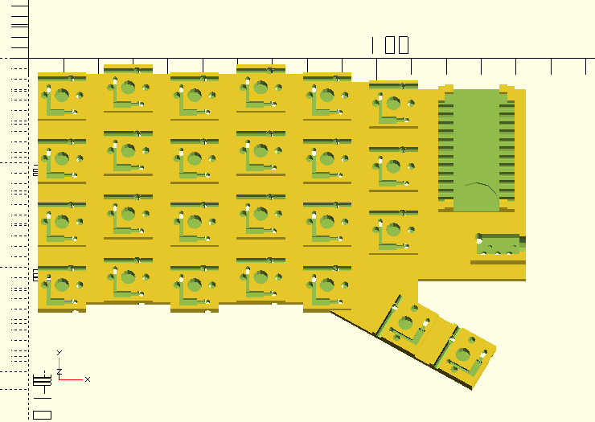

This is also the stage at which you can add stabilizers, if applicable. Once again, there's a layout vector, and `extra_data` is defined as `[key_size, left_offset, right_offset, switch_offset=0]`. Luckily, you shouldn't need to actually set those values yourself. Presets for all the common key sizes are located in `stabilizer_spacing.scad`, along with an explanation of how to measure all the relevant values. See the `numpad.scad` example layout for a sample usage of this. You shouldn't need to add additional borders here, since it will sit inside the borders automatically generated for the wider key.

#### PCB Shaping
After you have all of your components placed, there are some more refinements that can be made to the shape of the PCB. In particular, you may want to close up the gap between the thumb keys and the TRRS socket. To do that, you should extend the right border of the thumb cluster and the right border of the TRRS socket (which is rotated to be the bottom border) until they meet. With some math or trial-and-error you can get them to meet approximately at a point. Ideally, you should get them within 0.01mm, which will help when shaping the plate later. I'm working on a more elegant way to do this, but this works well enough for now.

Thinking ahead a bit, you probably want your column and TRRS wires to be easily routable from the bottom of the PCB to the top without going all the way around, You can do this using a via, which is just a hole in the PCB (the bootleg version of a real PCB via). Vias are laid out like any other component, with `extra_data = [via_width, via_length]`. For more details, check the `scad/` README.  

If all you needed is a PCB, you're done:
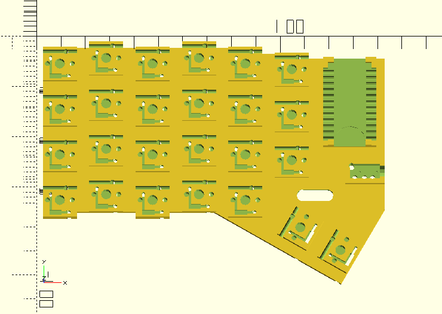

#### Plate Shaping (Optional)
By default, the plate profile is generated by using `hull()` and `offset()` on the PCB footprint. For rectangular layouts, this should be more or less sufficient, but if your layout has any concave areas (such as next to a thumb cluster), those will be filled in by the `hull()` operation. If all you need is a basic PCB, of you're fine with the basic plate generation, you can skip this section.

The primary mechanism for shaping the plate is the `base_plate_layout` variable. The layout format for each element is the same as everything else, where `extra_data` is a vector of the format `[component_type, extra_extra_data]`. `component_type` is selected from `["switch", "mcu", "trrs", "stab"]`, corresponding to what kind of element it is, and `extra_data` is any extra data you want passed down to the element's plate footprint module. `["switch"]` is the default, so you don't need to set it explicitly for those. However, instead of being a single vector of elements, `base_plate_layout` a vector of vectors of elements.

If `use_plate_layout_only = false`, then all the vectors are flattened, and added to the `hull()` that forms the case profile as described above. This can be useful if you just want to make your plate larger than the PCB in some dimension. Just remember that your single vector still needs to be wrapped in another vector.

If `use_plate_layout_only = true`, then things get interesting. Instead of using all the elements from `base_switch_layout`, `base_mcu_layout`, `base_trrs_layout`, and `base_plate_layout`, only the elements from `base_plate_layout` are used. And instead of a `hull()` over all the elements, each sub-vector has its elements hulled separately, and then all of these sub-plates are unioned before the offset is applied, allowing you to create concave forms. For the default layout, I union the thumb cluster keys separately from everything else. I also set the top border of the MCU to be -2, which has the effect of reducing the distance between the MCU connector and the edge of the plate.

Note that since only `base_plate_layout` is used in this mode, you need to copy all the components from the other component layouts in order for the complete plate to be generated. To make this easy, I've provided a `slice()` function to help copy over the relevant portions of those other layouts. See `default_layout.scad` for an example of its usage. The bounds support negative values, so you can index from the end of the array. You can set the end bound to `0` to indicate the end of the vector. In addition, an optional third parameter can be used to override any existing `extra_data` in the layout.

Where two sub-plates meet at an external vertex, the plate footprint can start to look weird if the corners of the sub-plates aren't close enough together. Here's an example:
<table style="border-collapse: collapse;">
<tr>
<td style="border: none; width: 30%;">
    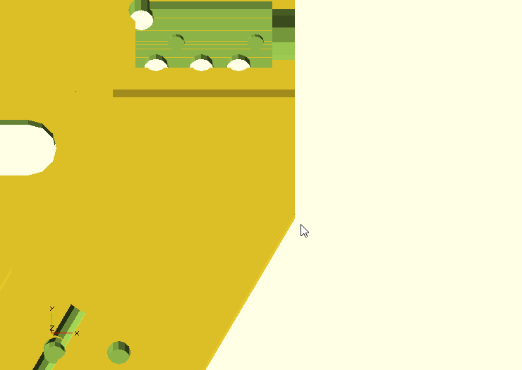
</td>
<td style="border: none; width: 30%;">
    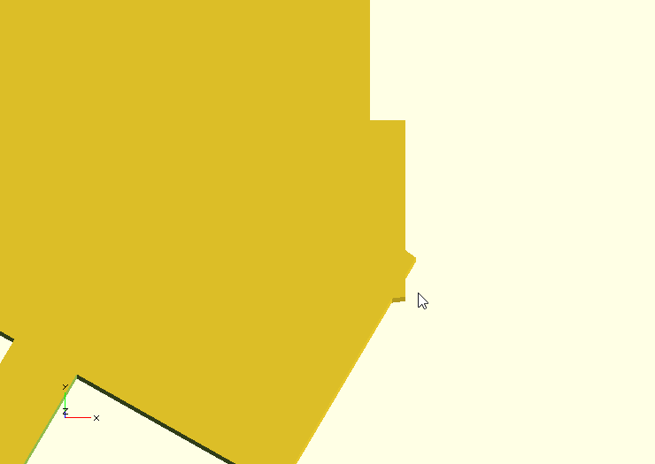
</td>
<td style="border: none; width: 30%;">
    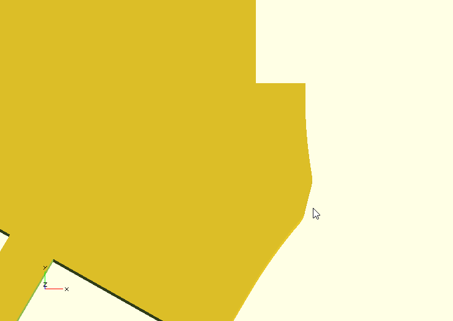
</td>
</tr>
<tr>
<td style="border: none; width: 30%;">
    <p> Here we've changed the borders on the TRRS and thumb cluster a bit, but the PCB still looks fine... </p>
</td>
<td style="border: none; width: 30%;">
    <p> ... but when the offset is applied, the error at the corner is magnified because they are not actually the same point. </p>
</td>
<td style="border: none; width: 30%;">
    <p> When we apply the final rounding offset, the corner artifact manifests as a weird lumpiness in the corner. </p>
</td>
</tr>
</table>

It seems that OpenSCAD treats points within ~0.00003mm of each other as being the same, but it's not practical to get plate points within those kinds of tolerances, which starts to require some annoying trigonometry. To combat this issue, the `plate_precision` parameter is used to increase that merge tolerance to something more usable. For example, the default value of `0.01` requires you to get points within ~0.01mm away from each other before they merge. You can set this higher if you wish, but the downside is that this precision/rounding factor is applied to the entire plate outline, so excessively large values can cause your plate to become misshapen. Here's an extreme example, where `plate_precision = 5`:
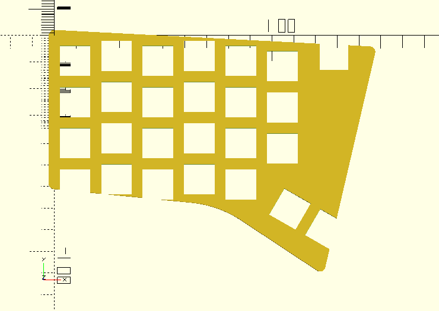

I'm looking into other ways to fix this issue, but this is what we have for now.

In addition to the layout, there are some plate-related parameters in `parameters.scad`. `plate_margin` defines the total offset (in mm) from the PCB profile. I used 5 as the default, which is just wide enough to squeeze in a standoff or a case wall. `plate_outer_fillet` and `plate_inner_fillet` define the radius of the inner and outer fillets on the plate profile.

#### Standoff Placement
Standoffs are useful to keep the plate attached to the PCB without solely relying on the friction fit between the switches and the PCB. They can also be used to attach a backplate to the PCB-plate assembly if desired. Even if you're generating a case, you need standoffs to screw everything together. By default, the standoffs are designed for M2 screws to self-tap into the plastic, though there is an option to use separate brass standoffs.

Standoffs are placed using a layout vector, with `extra_data = [standoff_integration_override, standoff_attachment_override]`. `standoff_integration_override` defines which component the standoff is printed with, and is set to `"plate"` by default. `standoff_attachment_override` defines which component the standoff gets screwed into, and is `"pcb"` by default. In addition to standoffs, this will also generate screw holes and clearance holes in the PCB where standoffs between the plate and backplate can pass through. More details are available in the `scad/` README.

For the default layout I may have gone slightly overboard on the standoffs, but I wanted to make sure there was a secure hold between all the components:
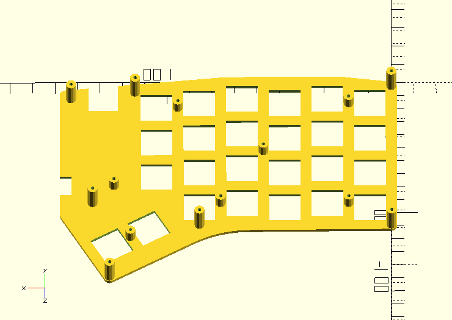

#### Case Options
If you want something more solid, I recommend generating a case instead of just a plate-backplate sandwich. Case parameters are located in `parameters.scad`, and `case.scad` generates the actual case geometry, based on the plate geometry.

The first option is `case_type`, which can be selected from `["sandwich", "plate_case", "backplate_case"]`. `"sandwich"` is just a basic plate and backplate connected by standoffs, while `"plate_case"` is an integrated-plate case that screws into a backplate via the same standoffs. `"backplate_case"` is unimplemented, but is planned to be some kind of tray-mount construction.

`case_wall_thickness` is pretty self-explanatory, and I wouldn't recommend going below the default value of 2mm.

If `use_plate_layout_only = false`, your case profile is guaranteed to be convex, which unlocks the ability to use some cosmetic shaping options. `case_wall_draft_angle` makes the sides of the case angle outwards instead of going straight down, creating a wider base and some visual interest. `case_base_height` creates a vertical-walled portion at the bottom of the case below the drafted section. `case_chamfer_width` and `case_chamfer_angle` let you put a chamfer around the edge of the plate. Here's an example using the default layout:
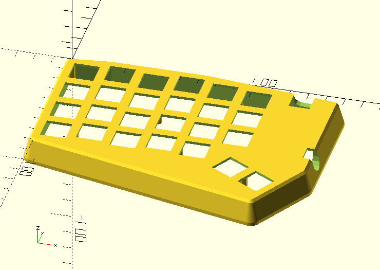

Finally, we have tenting options. Currently, tenting is implemented via the backplate, which can be swapped out to create different angles on the same case. `tent_angle_x` and `tent_angle_y` define the rotation around the respective axes, while `tent_point` defines the point that will stay at `z = 0`. You should put this near the bottom left of your case, so that no part of the case goes negative, as this will cause backplate generation to fail. For the default layout, I put the tent point at the bottom left corner of the main key cluster:
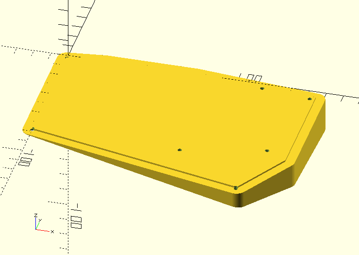

Here's what the case looks like assembled:
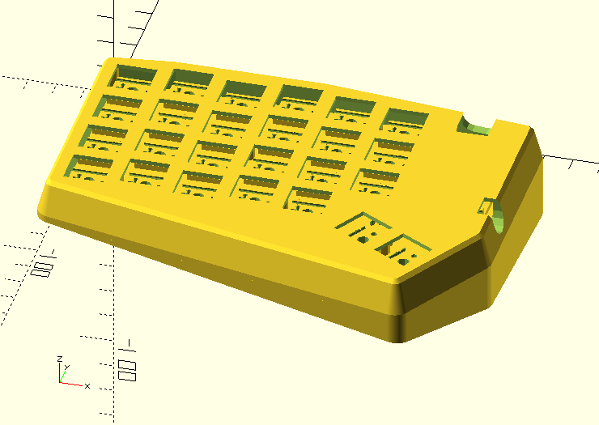

Now you should be ready to print! If you're working on a symmetrical split layout, you can simply set `invert_layout_flag = false` to generate all the files for the other side.

#### Advanced Options
There are a ton of other options you can play with that are all documented in the `scad/` README, but I'll just touch on a couple of them here.

The first two involve key spacing. By default, everything is set up to accommodate the standard 19.05mm key spacing that MX keycaps use. However, if you're using Choc or custom keycaps, you can decrease that spacing (within limits) by modifying the `unit`, `h_unit`, and/or `v_unit` variables in `parameters.scad`.

If you're using an MCU that's not Pro Micro-compatible, you'll need to break out your calipers and modify the MCU parameters in `parameters.scad` to fit your PCB.

If you're having trouble with flaky hotswap connections, you can try using the experimental `use_folded_contact` option, which will generate a slightly different socket and a new diode bending jig, but I don't have a tutorial for that one yet.
